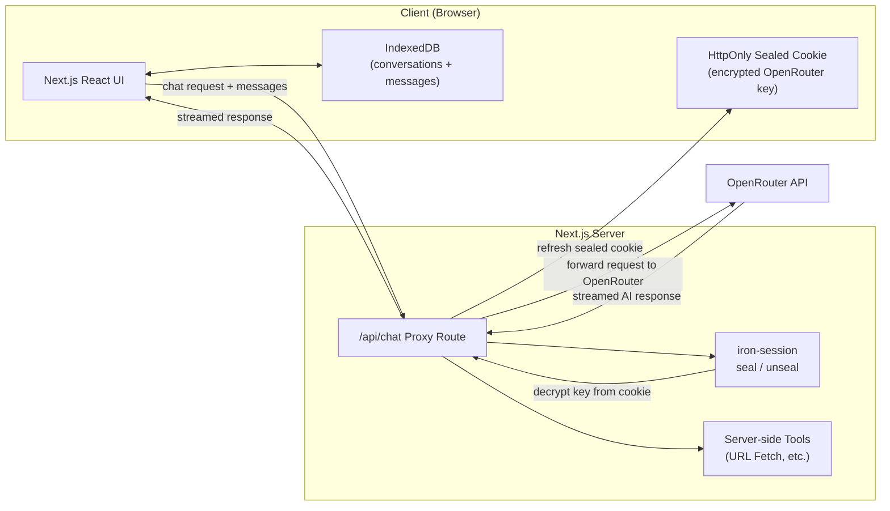

<h1>
  <picture>
    <source media="(prefers-color-scheme: dark)" srcset="public/stash-chat-dark.svg">
    <source media="(prefers-color-scheme: light)" srcset="public/stash-chat-light.svg">
    
  </picture>
  StashChat – Privacy-First AI Chat
</h1>

A **browser-local AI chat app** powered by OpenRouter, where your conversation history lives in your browser.

---

## Live Demo

**Deployed App:**
https://stashchat.mohdriaz.com

<picture>
  <source media="(prefers-color-scheme: dark)" srcset="https://github.com/user-attachments/assets/b051520b-3587-4774-804a-695c8751cc65">
  <source media="(prefers-color-scheme: light)" srcset="https://github.com/user-attachments/assets/076389e2-8f7e-471b-a33a-bd24298c1cb6">
  
</picture>

---

## Features

- No account or sign-up required
- Conversations stored entirely in your browser via **IndexedDB** , never on a server
- **Bring your own OpenRouter key** , encrypted server-side with iron-session
- Access to **hundreds of AI models** through OpenRouter (including free-tier models with no key)
- Per-message model label showing the requested model and the actual model used
- **Web search** tool (OpenRouter-native) and **URL fetch** tool (converts web pages to Markdown)
- Image attachment support for vision-capable models

---

## Architecture

The Next.js server acts as a **proxy** between the browser and OpenRouter. The browser never calls OpenRouter directly , all requests go through the server, which decrypts the API key from the cookie and forwards the request.



---

## Privacy Model

- All conversations and message history are stored in **IndexedDB** in the user's browser , never on the server
- The raw OpenRouter API key is **never stored in the browser** and never appears in client-side JavaScript
- When you enter your key, the proxy server seals it using `iron-session` (AES-256-GCM + HMAC) with a server-only secret, and sends back an `HttpOnly; Secure; SameSite=Strict` cookie , inaccessible to JavaScript
- On every chat request the proxy unseals the key from the cookie, calls OpenRouter server-side, and streams the response back , your raw key never leaves the server
- Without an API key the proxy falls back to free-tier OpenRouter models, so the app works out of the box

---

## Tech Stack

### Frontend

- Next.js 16 (App Router)
- React 19
- Tailwind CSS v4
- Zustand (state management)
- Vercel AI SDK (`@ai-sdk/react`)

### Backend

- Next.js API Route (`/api/chat`)
- OpenRouter AI SDK Provider
- iron-session (API key encryption)

### Storage

- IndexedDB (via `idb`) , all conversation and message data

---

## Installation

Clone the repository:

```bash
git clone https://github.com/mohd-riaz/StashChat.git
cd StashChat
```

Install dependencies:

```bash
npm install
```

Create a `.env.local` file:

```env
# Required: must be at least 32 characters
STASHCHAT_COOKIE_SECRET=your_random_secret_at_least_32_chars

# Optional: fallback key used when no user key is configured
OPENROUTER_API_KEY=sk-or-v1-...
```

---

## Running Locally

```bash
npm run dev
```

Open [http://localhost:3000](http://localhost:3000) in your browser.

---

## Deployment

- **Frontend + Backend:** Vercel

---

## Key Learnings

- Designing a **privacy-first architecture** where user data never touches the server
- Encrypting secrets in **HttpOnly cookies** instead of browser storage
- Streaming AI responses with the **Vercel AI SDK** and OpenRouter
- Building a fully **browser-local** chat history using IndexedDB
- Integrating server-side **tool execution** (URL fetch) alongside provider-native tools (web search)

---

## License

MIT License
